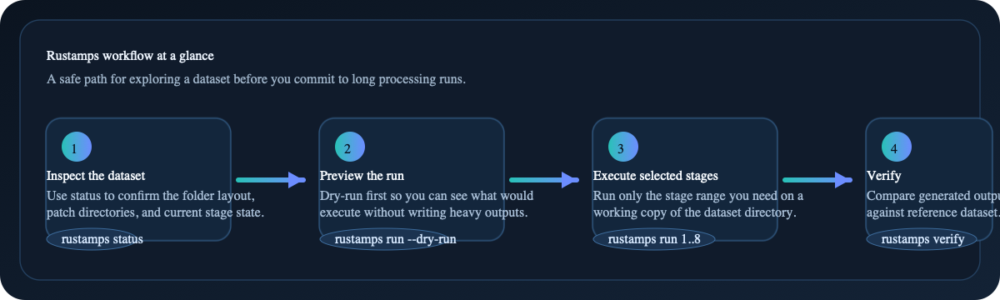

<div align="center">
  

# Rustamps

  <p><strong>Standalone Rust implementation of StaMPS persistent-scatterer processing.</strong></p>
  <p>SNAP preparation · Stages 1–8 · MAT I/O · resumable processing · scientific verification</p>

  <p>
    <a href="https://github.com/sirbastiano/rustamps/actions/workflows/portable-rust.yml"></a>
    <a href="https://github.com/sirbastiano/rustamps/actions/workflows/conda-package.yml"></a>
    <a href="https://anaconda.org/sirbastiano/rustamps"></a>
    <a href="https://anaconda.org/sirbastiano/rustamps"></a>
    <a href="https://anaconda.org/sirbastiano/rustamps"></a>
    <a href="LICENSE"></a>
    
  </p>

  <p>
    <a href="https://sirbastiano.github.io/rustamps/"><strong>Documentation</strong></a>
    ·
    <a href="https://anaconda.org/sirbastiano/rustamps"><strong>Download</strong></a>
    ·
    <a href="https://github.com/sirbastiano/rustamps/issues"><strong>Issues</strong></a>
  </p>
</div>

---

Rustamps is a standalone Rust implementation of the production StaMPS
persistent-scatterer workflow. It runs without loading Python, MATLAB, SNAPHU,
Triangle, a system HDF5 library, or another scientific executable. The retained
Python and PyO3 sources are audit oracles; Cargo does not compile or install
them.

## Why Rustamps?

| | Capability |
|---|---|
| **Native** | One standalone Rust CLI with no language-runtime handoff |
| **Complete** | SNAP preparation and the supported single-master Stages 1–8 |
| **Safe** | Transactional stage publication and explicit downstream invalidation |
| **Resumable** | Fingerprinted, checksummed Stage 6 checkpoints |
| **Verifiable** | Strict and tolerance-aware comparison against golden datasets |
| **Portable** | 64-bit Linux, macOS, and Windows on x86_64 and ARM64 |



## Download

### Conda package

The `rustamps` 0.3.0 development-channel package contains the native CLI:

```bash
conda create -n rustamps \
  -c sirbastiano/label/dev \
  -c conda-forge \
  rustamps=0.3.0

conda activate rustamps
rustamps --version
rustamps describe-backends
```

For non-interactive shells, leave the environment inactive and prefix commands
with `conda run -n rustamps`, for example
`conda run -n rustamps rustamps --version`.

Browse every available package and platform on
[Anaconda.org](https://anaconda.org/sirbastiano/rustamps). Tagged source and
future release assets live on
[GitHub Releases](https://github.com/sirbastiano/rustamps/releases).

The Conda builds target `linux-64`, `linux-aarch64`, `osx-64`, `osx-arm64`,
`win-64`, and `win-arm64`. Windows ARM64 remains experimental on the `dev`
label. Linux packages require glibc 2.17 or newer; macOS packages require
macOS 11 or newer.

### Build from source

Install Rust 1.89 or newer:

```bash
git clone https://github.com/sirbastiano/rustamps.git
cd rustamps
cargo install --path . --locked
rustamps --help
```

If `cargo install` succeeds but `rustamps` is not found, add Cargo's binary
directory to `PATH` (normally `$HOME/.cargo/bin` on Unix or
`%USERPROFILE%\.cargo\bin` on Windows). For the current Unix shell:

```bash
export PATH="${CARGO_HOME:-$HOME/.cargo}/bin:$PATH"
```

No Python environment or system HDF5 library is required.

Linux musl users should build from source. Other 32-bit, big-endian, BSD,
mobile, and WebAssembly targets are not currently supported.

## Five-minute pipeline

Always process a writable copy when comparing with a reference dataset.

```bash
# 1. Prepare a compatible SNAP export
rustamps prep snap \
  --dataset /data/run \
  --amp-dispersion 0.4 \
  --range-patches 1 \
  --azimuth-patches 1

# 2. Inspect and rehearse the writes
rustamps status --dataset /data/run
rustamps run --dataset /data/run --start-step 1 --end-step 8 --dry-run

# 3. Execute the native pipeline
rustamps run --dataset /data/run --start-step 1 --end-step 8

# 4. Compare every production artifact
rustamps verify --run /data/run --golden /data/golden
```

Use `--master-date YYYYMMDD` during preparation when the master cannot be
inferred. Run any contiguous stage range by changing `--start-step` and
`--end-step`; use `--start-step 0` to resume from existing completion markers.

## Scientific contract

Rustamps deliberately fails closed instead of substituting a different
scientific method. The validated production path is the single-master workflow
(`small_baseline_flag='n'`). Unsupported small-baseline branches, external
unwrapping, non-native kernels, and nonstandard Stage 6 modes are rejected
before output is written.

The native Stage 6 solver is self-contained and follows the integer-flow model.
Large stacks can take time, but per-interferogram work resumes from matching
atomic checkpoints. The final `phuw2.mat` is published only after every solve
succeeds.

For faster exploratory runs, use one of the explicit coarser-grid profiles:

```bash
rustamps --config configs/stage6-balanced.yaml run \
  --dataset /data/run --start-step 6 --end-step 8
```

Validate a speed profile against a strict-grid result before adopting it for a
dataset. Floating-point and solver-path differences belong in the verifier,
not in file-hash comparisons.

## Command map

```text
rustamps prep snap         Prepare native SNAP exports
rustamps run               Execute Stages 1–8
rustamps status            Inspect available artifacts
rustamps verify            Compare a run with a golden dataset
rustamps describe-inputs   Show per-stage data scope
rustamps describe-backends Report the compiled runtime boundary
rustamps list-legacy       Inventory an external StaMPS script tree
```

`list-legacy` is read-only inventory support. It never executes the scripts it
finds.

## Documentation

The static documentation is ready to serve directly from GitHub Pages:

- [Start here](https://sirbastiano.github.io/rustamps/)
- [Installation](https://sirbastiano.github.io/rustamps/installation.html)
- [Input data and SNAP export](https://sirbastiano.github.io/rustamps/inputs.html)
- [Quick start](https://sirbastiano.github.io/rustamps/quickstart.html)
- [Configuration](https://sirbastiano.github.io/rustamps/configuration.html)
- [Pipeline science guide](https://sirbastiano.github.io/rustamps/pipeline-science-guide.html)
- [Architecture](https://sirbastiano.github.io/rustamps/architecture.html)
- [Verification](https://sirbastiano.github.io/rustamps/verification.html)

After the first push, enable **Settings → Pages → Deploy from a branch**, select
the default branch, and choose the `/docs` folder. No Jekyll build is required.

For local preview:

```bash
python3 -m http.server 8000 --directory docs
```

Then open <http://localhost:8000/>.

## Development

```bash
cargo fmt --all -- --check
cargo test --workspace --locked
cargo build --release --locked
cargo tree -p rustamps
```

The production dependency audit should show no `pyo3`, `numpy`, Python
runtime, SNAPHU, or Triangle dependency. The root package sets
`autolib = false` so the legacy `src/lib.rs` oracle cannot be discovered by
Cargo accidentally.

The reference-only `oracle/pyproject.toml` sets `tool.uv.package = false`; it
does not define an installable Python package.

```text
crates/rustamps-core      Numerical kernels and stage models
crates/rustamps-io        Pure-Rust MAT and SNAP dataset I/O
crates/rustamps-pipeline  Transactional orchestration
crates/rustamps-verify    Scientific comparison
crates/rustamps-cli       Installed rustamps command
oracle/, pystamps/, src/  Retained historical reference material
```

Contributions are welcome. Please read [CONTRIBUTING.md](CONTRIBUTING.md) and
keep changes scoped, reproducible, and scientifically verifiable.

## License

Licensed under [Apache-2.0](LICENSE).
