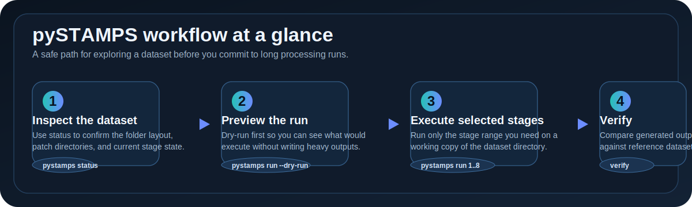
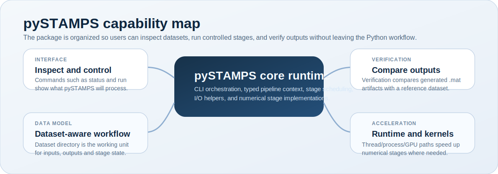

<div align="center">


# pySTAMPS

Python-first StaMPS migration runtime for structured InSAR processing, verification, and reproducible parity workflows.

Run pipeline stages, inspect dataset state, and verify outputs against reference datasets.

<p align="center">
  <a href="docs/index.html"></a>
  <a href="docs/quickstart.html"></a>
  <a href="docs/api/pystamps.html"></a>
  <a href="examples/00_pystamps_beginner_walkthrough.ipynb"></a>
</p>

</div>

**Author:** Roberto Del Prete

pySTAMPS runs StaMPS-style persistent-scatterer pipelines on a dataset folder, and it can compare generated outputs with a reference run for deterministic validation.

<p align="center">
  
</p>

<p align="center">
  <em>From dataset inspection to dry-run, execution, and verification.</em>
</p>

<p align="center">
  
</p>

<p align="center">
  <em>Core package responsibilities and where each capability fits.</em>
</p>

If you are new to interferometry, start here:
- [docs/index.html](docs/index.html): HTML documentation home
- [docs/quickstart.html](docs/quickstart.html): first-run path through the package
- [docs/usage.html](docs/usage.html): command patterns and workflow examples
- `examples/00_pystamps_beginner_walkthrough.ipynb`: notebook walkthrough on the reference datasets in this repo
- [docs/api/pystamps.html](docs/api/pystamps.html): API entrypoint for the package modules and functions

## What pySTAMPS does

At a high level, pySTAMPS:
- reads a StaMPS-style dataset directory
- determines which processing stages can run
- runs selected stages from 1 through 8
- writes `.mat` outputs back into the dataset directory
- compares a run directory against a known-good reference dataset when you use `verify`

You do not need to know the mathematics of interferometry to start using the package. You do need to understand one practical idea:
- a dataset directory is the working unit
- pySTAMPS reads inputs from that directory and writes outputs back into it
- because of that, it is safest to run on a copy of your dataset, not your only original

In practice, most users interact with pySTAMPS in four steps:
- inspect a dataset with `pystamps status`
- preview a run with `pystamps run --dry-run`
- execute only the stages they need
- verify the produced outputs against a known reference when needed

## Install

Install the published package:

```bash
pip install pystamps
```

Optional GPU support:

```bash
pip install "pystamps[gpu]"
```

External prerequisites are not bundled in the package:
- `triangle` for stage-4 triangulation workflows
- `snaphu` for unwrap workflows
- a separate `StaMPS` checkout only when using `pystamps list-legacy`
- external datasets and golden artifacts for parity validation
- the maintained run-copy seed `inputs_and_outputs/RUN_FULL_GATE_1e10` for the release-grade `InSAR_dataset_test` refresh path

The wheel ships the `pystamps` Python package and package metadata. The sdist ships the Python source tree and tracked docs needed to rebuild that package, while generated release outputs under `dist/`, `build/`, and local parity datasets under `inputs_and_outputs/` remain outside the release artifacts.

## Development setup

```bash
# Editable install with optional dev extras
python -m pip install -e ".[dev]"
# or with legacy setuptools flow
python -m pip install -e .
# if using make targets:
make setup
```

Fresh-clone validation commands:

```bash
python -m pytest -q
python -m pip install build twine
python -m build --sdist --wheel
python -m twine check dist/*
# or
make test
make test-impl
make build
make twine-check
```

## Quick start

Inspect a dataset before you run anything:

```bash
python -m pystamps status --dataset inputs_and_outputs/InSAR_dataset_test
```

Preview a run without doing heavy work:

```bash
python -m pystamps run \
  --dataset inputs_and_outputs/InSAR_dataset_test \
  --start-step 1 --end-step 8 --dry-run
```

Run the pipeline on a working copy of your dataset:

```bash
cp -a /path/to/input_dataset /path/to/input_dataset_run
python -m pystamps run \
  --dataset /path/to/input_dataset_run \
  --start-step 1 --end-step 8
```

Verify a run against a golden dataset:

```bash
python -m pystamps verify \
  --run /path/to/run_dataset \
  --golden /path/to/golden_dataset
```

Use `make verify` only for the repo's maintained reference-path check:
`inputs_and_outputs/RUN_FULL_GATE_1e10` against
`inputs_and_outputs/InSAR_dataset_test`.

For a slower, stricter repo-level audit of the maintained validation datasets, see [howtorun.md](howtorun.md) and the parity section below.

## CLI commands

`pystamps` provides four main commands:
- `status`: inspect dataset layout and detected stage progress
- `run`: execute one or more processing stages
- `verify`: compare a run directory against a golden dataset
- `list-legacy`: discover legacy StaMPS scripts from a StaMPS checkout

Examples:

```bash
pystamps status --dataset inputs_and_outputs/InSAR_dataset_test
pystamps run \
  --dataset inputs_and_outputs/InSAR_dataset_test \
  --start-step 1 --end-step 8 --dry-run
pystamps verify \
  --run inputs_and_outputs/InSAR_dataset_test \
  --golden inputs_and_outputs/InSAR_dataset_test
pystamps list-legacy --stamps-root /path/to/StaMPS
```

Environment-based legacy discovery:

```bash
STAMPS_ROOT=/path/to/StaMPS pystamps list-legacy
```

## Configuration

Use `--config` when you want to tune runtime behavior or compatibility options.

Strict legacy parity replay mode:

```yaml
# config.yaml
compat:
  strict_reference: true
  reference_root: /abs/path/to/original/outputs
```

```bash
pystamps --config config.yaml run --dataset /path/to/run_copy --start-step 2 --end-step 8
```

Acceleration backend selection:

```yaml
# accel.yaml
runtime:
  backend: auto   # auto | threads | processes | gpu | native
  io_workers: 8
  cpu_workers: 0
  stage7_chunk_ps: 100000
  stage8_chunk_edges: 200000
  enable_mat_stage_cache: true
```

```bash
pystamps --config accel.yaml run --dataset /path/to/dataset --start-step 1 --end-step 8
```

See [docs/function_reference.md](docs/function_reference.md) for the configuration dataclasses and loader details.

## Validation and benchmarking

Optional local-dataset parity validation:

```bash
OPENBLAS_NUM_THREADS=1 OMP_NUM_THREADS=1 MKL_NUM_THREADS=1 PYTHONPATH=. \
  python scripts/validate_audit.py \
    --datasets \
      inputs_and_outputs/InSAR_dataset_test_stage8diag \
      inputs_and_outputs/InSAR_dataset_test \
    --output inputs_and_outputs/validation_runs/latest_audit.json
# or
make audit
```

Resolve the required full-loop run copy for the explicit verify gate from the fresh audit artifact:

```bash
RUN_COPY="$(python - <<'PY'
import json
from pathlib import Path

payload = json.loads(Path('inputs_and_outputs/validation_runs/latest_audit.json').read_text(encoding='utf-8'))
print(next(audit['run_root'] for audit in payload['audits'] if audit['dataset'] == 'InSAR_dataset_test'))
PY
)"
OPENBLAS_NUM_THREADS=1 OMP_NUM_THREADS=1 MKL_NUM_THREADS=1 PYTHONPATH=. \
  python -m pystamps verify --run "$RUN_COPY" --golden ./inputs_and_outputs/InSAR_dataset_test
```

This explicit verify gate must use the fresh `run_root` from
`latest_audit.json`. `make verify` does not replace this step; it only checks
the repo's fixed maintained reference paths.

Strict parity audit notes:
- `scripts/validate_audit.py` is the supported unattended audit entrypoint.
- The audit validates both required datasets before verification begins, creates fresh run copies under `inputs_and_outputs/validation_runs/<timestamp>/`, and exits non-zero with a missing-dataset report if either path is absent.
- `InSAR_dataset_test` currently refreshes from the maintained seed `inputs_and_outputs/RUN_FULL_GATE_1e10` starting at stage 4, while `InSAR_dataset_test_stage8diag` refreshes from the dataset root starting at stage 2.
- The explicit verify gate must use the `run_root` recorded in `inputs_and_outputs/validation_runs/latest_audit.json`; stale copies such as older `validation_runs/*` directories do not satisfy the gate.
- Any interruption, manual restart, or partial reuse of stale outputs is a validation failure rather than a passing audit.
- `latest_audit.json` records the contract, per-dataset audits, `failed_workflows`, `completed`, `interrupted`, and `ok`.

Benchmark runner:

```bash
python scripts/benchmark_backends.py \
  --dataset inputs_and_outputs/InSAR_dataset_test_stage8diag \
  --start-step 1 --end-step 8 \
  --repeat 3 --warmup 1
```

Or use the documented make target:

```bash
make benchmark
```

- Each measured run now executes on a dedicated dataset copy under `inputs_and_outputs/benchmarks`.
- Benchmark subprocesses pin `OPENBLAS_NUM_THREADS=1`, `OMP_NUM_THREADS=1`, and `MKL_NUM_THREADS=1` for reproducible CPU timings.

## Build and distribution

Create release artifacts:

```bash
python -m build --sdist --wheel
```

Check release artifacts:

```bash
python -m twine check dist/*
```

Manual upload targets:

```bash
python -m twine upload --repository testpypi dist/*
python -m twine upload dist/*
```

Build outputs are written to `dist/` as one wheel and one sdist. Generated release directories such as `dist/` and `build/` are excluded from future source builds so packaging validation stays reproducible. The release process is manual and tag-driven; see [docs/release.md](docs/release.md) for the full checklist.

## Additional reading

- [docs/getting_started.md](docs/getting_started.md)
- [howtorun.md](howtorun.md)
- [docs/function_reference.md](docs/function_reference.md)
- `examples/00_pystamps_beginner_walkthrough.ipynb`
- [docs/architecture.md](docs/architecture.md)
- [docs/release.md](docs/release.md)

## Governance

- [Code of Conduct](CODE_OF_CONDUCT.md)
- [License](LICENSE) (Apache License 2.0)

## Notes

- Stages 1-8 now execute in Python if artifacts are missing.
- The checked-in parity workflow is expected to reproduce the golden StaMPS artifacts exactly on the required datasets.
- Local parity datasets under `inputs_and_outputs/` are optional repo assets used for audit and verify workflows; a fresh clone can still run the unit/build/package gates without them.
- Repo-only developer workflows such as `scripts/validate_audit.py` require the full source tree, not just an installed wheel.
